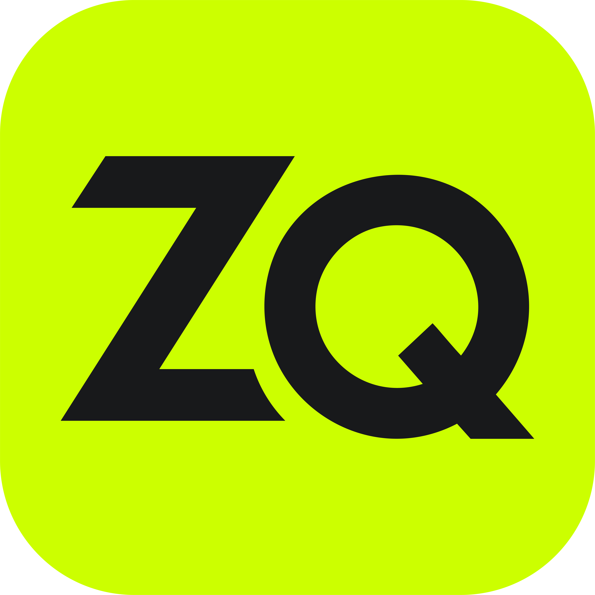

  

<h1 align="center">ZeroQuota</h1>

  <strong>Premium AI Quota Monitoring & Terminal Automation for Antigravity IDE.</strong> 
  Stay ahead of limits with real-time telemetry, historical usage tracking, and automated discovery.

---

## 📊 Real-Time Quota Telemetry

Monitor your AI usage directly from the VS Code Status Bar and a high-fidelity Dashboard.

- **Dynamic Urgency Indicator**: Status text changes color as you exhaust your quota.
- **Interactive Tooltip**: Hover for instant details on Gemini Pro, Gemini Flash, and Claude limits.
- **Historical Analysis**: Visualize your usage patterns with beautiful SVG sparklines.

## 🧠 Brain Directory Management

Manage your Antigravity Brain files effortlessly from the sidebar.

- **Instant Search**: Find any file or folder in your brain directory instantly.
- **Deep Integration**: Open files directly in the active editor.
- **Smart Metadata**: View file counts and modification times at a glance.

## 🛠️ Zero-Config Automation

ZeroQuota automatically discovers and connects to the Antigravity Language Server.

- **Sidecar Discovery**: Intelligent process hunting for seamless connectivity.
- **Automatic Health Checks**: Real-time status indicators for telemetry health.
- **MCP Shortcuts**: Quick access to Model Context Protocol settings.

## ⚙️ Customizable Experience

Tailor ZeroQuota to your workflow with robust configuration options.

- **Notification Thresholds**: Get alerted when you're running low on credits.
- **Model Filtering**: Choose which models to track in your dashboard.
- **Adjustable Refresh Rates**: From real-time updates to manual pings.

---

### Getting Started

1. Install the extension.
2. Ensure Antigravity IDE is running.
3. Access the **ZeroQuota Dashboard** from the Activity Bar.

_Developed with precision for the modern AI-assisted developer._

### Developed by [@kalidahmdev](https://github.com/kalidahmdev)
