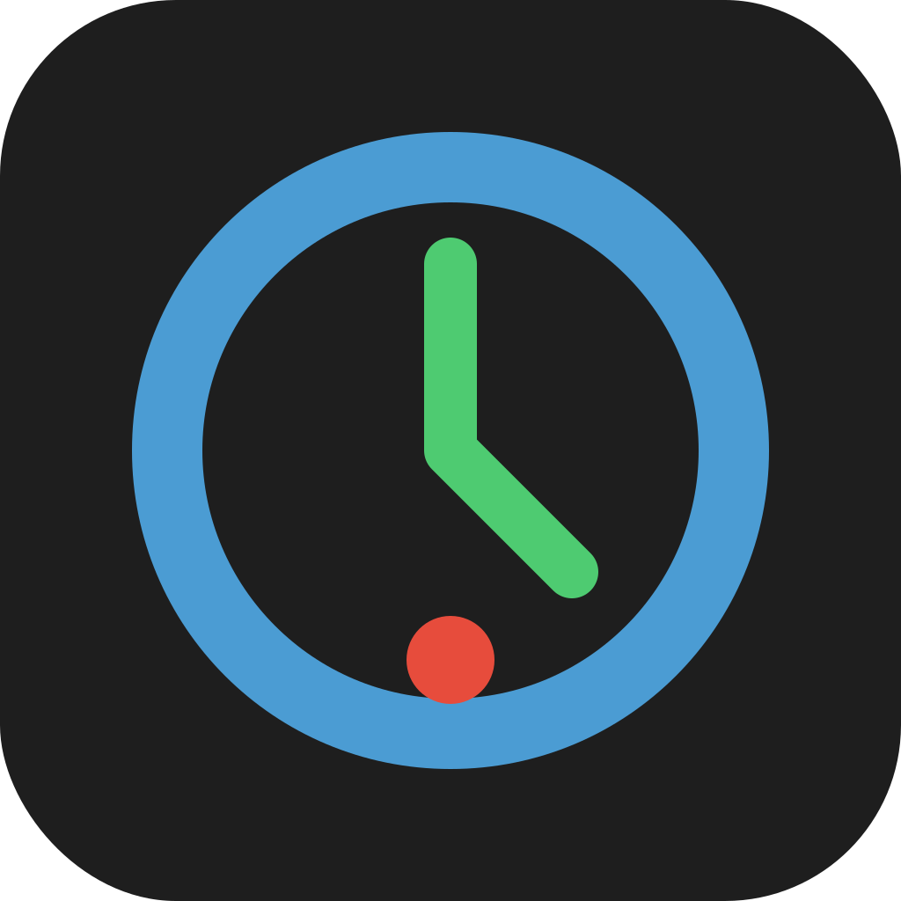

<p align="center">
  
</p>

<h1 align="center">ZeroQuota</h1>

<p align="center">
  <strong>Premium AI quota monitoring and hands-free terminal automation for Antigravity IDE.</strong>
</p>

<p align="center">
  <a href="#-features">Features</a> •
  <a href="#-tech-stack">Tech Stack</a> •
  <a href="#-getting-started">Getting Started</a> •
  <a href="#-design-system">Design System</a>
</p>

<p align="center">
  
  
  
  
</p>

---

## 🚀 Features

ZeroQuota provides real-time insights into your AI usage within Antigravity, ensuring you never hit a quota wall unexpectedly.

### 📊 Quota Monitoring

| Feature                   | Description                                                                               |
| :------------------------ | :---------------------------------------------------------------------------------------- |
| **Real-time Gauges**      | Visual SVG semi-circle gauges tracking remaining quota for active models (Cascade, etc.). |
| **Credit Tracking**       | Detailed progress bars for monthly Prompt and Flow credits.                               |
| **Recovery Matrix**       | At-a-glance view of when quotas will reset, color-coded by urgency.                       |
| **StatusBar Integration** | Minimalistic status bar item showing the most exhausted model's percentage.               |

### 🛠️ Automation & Orchestration

| Feature              | Description                                                                                           |
| :------------------- | :---------------------------------------------------------------------------------------------------- |
| **Auto-Discovery**   | Automatically probes for the Antigravity Language Server (Sidecar) via CSRF token and port detection. |
| **Dynamic Polling**  | Configurable polling interval to keep usage data fresh without impacting performance.                 |
| **Hands-free Logic** | Infrastructure prepared for automated terminal command approval (configurable via settings).          |

---

## 💻 Tech Stack & Architecture

### Core Philosophy

ZeroQuota is built for efficiency and deep integration with the Antigravity/VS Code ecosystem. It leverages a "Sidecar Discovery" pattern to communicate with the underlying language server securely.

| Component            | Technology               | Role                                               |
| :------------------- | :----------------------- | :------------------------------------------------- |
| **Language**         | TypeScript               | Type-safe extension logic.                         |
| **Communication**    | Axios + Connect Protocol | Fetching user status from the local sidecar.       |
| **UI Layer**         | VS Code Webview + SVG    | Premium, low-overhead dashboard rendering.         |
| **State Management** | Orchestrator Pattern     | Centralized management of services and UI updates. |

---

## 🔑 Configuration & Environment

Settings can be customized in `.vscode/settings.json` or through the VS Code Settings UI.

| Variable                       | Description                                                | Default | Required |
| :----------------------------- | :--------------------------------------------------------- | :------ | :------- |
| `zeroquota.autoUpdateInterval` | Polling interval in seconds for quota updates.             | `60`    | No       |
| `zeroquota.autoAccept`         | Automatically approve terminal commands (Hands-free mode). | `false` | No       |

---

## 📂 Project Structure

```text
Folder PATH listing for volume OS
C:\USERS\KHAAL\DESKTOP\ZEROQUOTA
|   .gitignore
|   package-lock.json
|   package.json
|   tsconfig.json
+---.agent
+---.vscode
|       launch.json
+---media
|       icon.svg
|       main.css
|       main.js
+---scripts
+---src
|   |   extension.ts
|   |   orchestrator.ts
|   +---panels
|   |       dashboardPanel.ts
|   +---services
|   |       sidecarService.ts
|   \---ui
|           statusBarManager.ts
\---out (Build artifacts)
```

---

## 🚀 API & Interaction

ZeroQuota interacts with the Antigravity Language Server via local loopback.

| Endpoint/Method | Description                                                 | Parameters                                  |
| :-------------- | :---------------------------------------------------------- | :------------------------------------------ |
| `GetUserStatus` | Fetches comprehensive user tier, credits, and model quotas. | `metadata (ideName, extensionName, locale)` |

---

## 🎨 Design System

ZeroQuota adheres to the **VS Code Premium Aesthetic**, utilizing theme variables for seamless integration.

- **Visual Language**: Modern, flat-square design with vibrant status indicators.
- **Typography**: Inherited from VS Code (`--vscode-font-family`).
- **Color System**:
  - 🟢 **Safe**: `> 40%` remaining.
  - 🟡 **Warning**: `20% - 40%` remaining.
  - 🔴 **Critical**: `< 20%` remaining.
- **Micro-animations**: Smooth transitions on gauges and progress bars via CSS.

---

## 🧪 Testing & Quality Assurance

| Test Type       | Tool                 | Purpose                                        |
| :-------------- | :------------------- | :--------------------------------------------- |
| **Integration** | Extension Host Tests | Verifying command registration and activation. |
| **Linting**     | ESLint               | Ensuring code consistency and security.        |

---

## 🗄️ Data Architecture

| Entity          | Description                                       | Relationships                  |
| :-------------- | :------------------------------------------------ | :----------------------------- |
| **UserStatus**  | Root entity containing email, tier, and credits.  | Contains many `ModelConfig`.   |
| **ModelConfig** | Specific model quota data (e.g., GPT-4, Cascade). | Associated with `QuotaInfo`.   |
| **QuotaInfo**   | Precise remaining fraction and reset timestamps.  | Sub-property of `ModelConfig`. |

---

## ⚡ Performance & Optimization

- **Efficient Discovery**: Uses PowerShell (Windows) or `ps`/`lsof` (Unix) to locate the Sidecar process only when needed.
- **Low Overhead**: Polling is throttled and stops when the extension is deactivated.
- **SVG Rendering**: High-performance, resolution-independent graphics for the dashboard.

---

## 🗺️ Roadmap & Maturity

- [x] Antigravity Language Server Discovery
- [x] Real-time Quota Dashboard
- [x] StatusBar Summary
- [/] Advanced Hands-free Mode (Logic in place)
- [ ] Multi-IDE Support infrastructure
