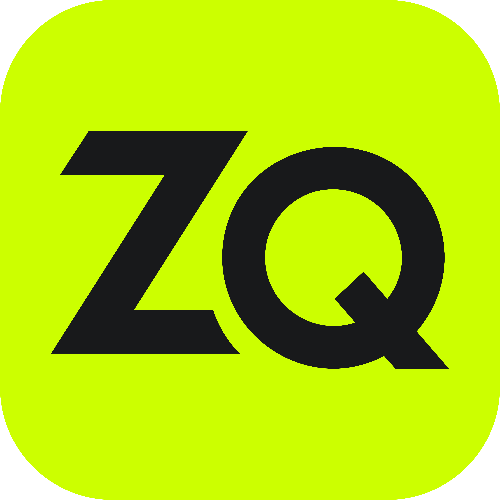
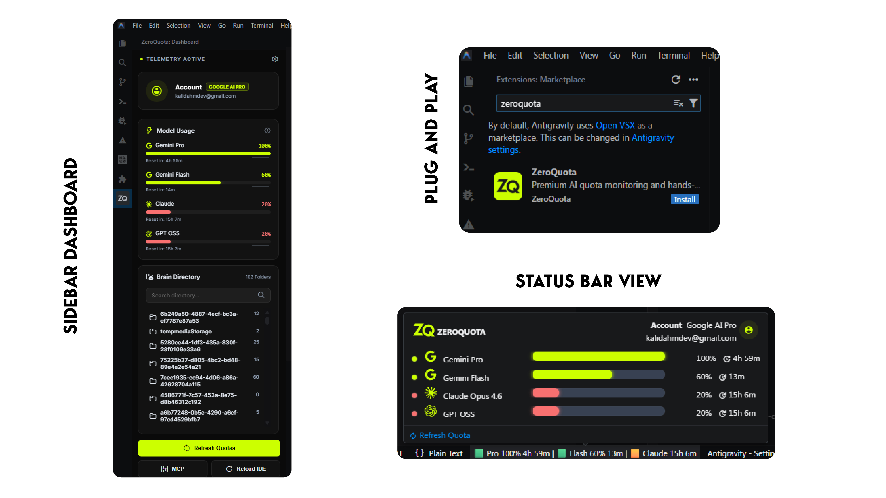

<p align="center">
  
</p>

<h1 align="center">ZeroQuota</h1>

<p align="center">
  <strong>Premium AI Quota Monitoring & Automation for Antigravity IDE.</strong><br>
  <em>Real-time telemetry, automated discovery, and a stunning Glassmorphism interface.</em>
</p>

<p align="center">
  <a href="#-key-features">Features</a> •
  <a href="#-tech-stack">Stack</a> •
  <a href="#-setup">Setup</a> •
  <a href="#-testing">Testing</a> •
  <a href="#-roadmap">Roadmap</a>
</p>

<p align="center">
  
  
  
  
</p>

<p align="center">
  
</p>

---

## 🚀 Key Features

ZeroQuota provides high-fidelity telemetry for AI developers using the Antigravity IDE.

### 📊 Quota Telemetry

| Feature                  | Description                                                      |
| :----------------------- | :--------------------------------------------------------------- |
| **Real-Time Monitoring** | Live tracking for Gemini 3 Pro, Flash, Claude, and GPT OSS.      |
| **Visual Sparklines**    | Dynamic SVG history representing rolling 5-hour usage telemetry. |
| **Smart Indicators**     | Color-coded urgency (Green → Yellow → Red) based on burn rates.  |

### 🧠 Automation & Integration

| Feature                | Description                                                                         |
| :--------------------- | :---------------------------------------------------------------------------------- |
| **Auto-Discovery**     | Detects the Antigravity `language_server` process and CSRF tokens automatically.    |
| **Brain Inspector**    | Integrated tree-view for the `~/.gemini/antigravity/brain` directory.               |
| **Global Status**      | High-visibility status bar indicators with interactive Markdown tooltips.           |
| **Theme-Aware Design** | Seamlessly adapts to Antigravity's Light and Dark themes for consistent visibility. |

---

## 🛠️ Tech Stack & Architecture

- **Core**: [TypeScript](https://www.typescriptlang.org/) (Strict Mode)
- **UI**: Vanilla HTML5/CSS3 with Glassmorphism Design Tokens.
- **Runtime**: Antigravity IDE Extension Host.
- **Build**: [esbuild](https://esbuild.github.io/) for near-instant bundling.

### 📂 Directory Map

```text
ZeroQuota/
├── assets/           # Logos, icons, and UI screenshots
├── src/
│   ├── core/         # Orchestrator & state synchronization
│   ├── services/     # Process discovery & sidecar API
│   ├── ui/           # Webview providers & status bar management
│   └── extension.ts  # Extension entry point
└── package.json      # Dependencies & configuration
```

---

## 🏁 Getting Started

### Prerequisites

- [Antigravity IDE](https://github.com/google/antigravity)
- [Node.js v20+](https://nodejs.org/)

### Installation

1. Clone the repo: `git clone https://github.com/kalidahmdev/ZeroQuota.git`
2. Install dependencies: `npm install`
3. Launch extension: Hit `F5` in VS Code to start debugging.

---

## 🧪 Testing & Quality 🧪

| Test Type      | Tool               | Purpose                                             |
| :------------- | :----------------- | :-------------------------------------------------- |
| **Unit Tests** | Vitest             | Validates core logic and server discovery.          |
| **Mocking**    | Axios Mock Adapter | Simulates API responses for robust offline testing. |
| **Linting**    | ESLint             | Ensures code quality and type-safety.               |

Execute all tests:

```bash
npm run test:full
```

---

## 🗺️ Roadmap

- [x] Multi-model quota monitoring
- [x] Theme-Aware UI (Light/Dark mode adaptation)
- [x] High-fidelity Sidebar Dashboard
- [x] Automated Sidecar Discovery
- [ ] Exportable usage reports (CSV/JSON)

---

## 🤝 Contributing

This is an open-source project and we welcome all contributions!

1. Fork the Project
2. Create your Feature Branch (`git checkout -b feature/AmazingFeature`)
3. Commit your Changes (`git commit -m 'Add some AmazingFeature'`)
4. Push to the Branch (`git push origin feature/AmazingFeature`)
5. Open a Pull Request

---

## 📜 License

Distributed under the MIT License. See `LICENSE` for more information.

Developed with ❤️ by **[@kalidahmdev](https://github.com/kalidahmdev)**.
